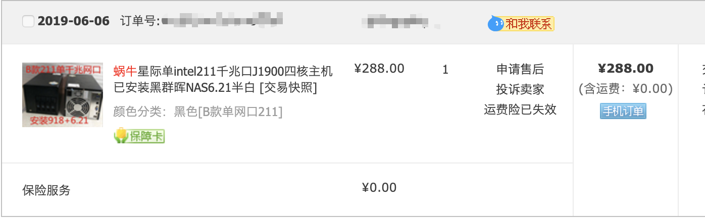

矿难捡漏，星际蜗牛 B 款单千兆网口 J1900 处理器 4GB DDR3 内存带 16GB MSata 硬盘。

## 前言

之前一直装的是 [OMV](https://www.openmediavault.org/)，现在换成了黑群晖。从体验上来讲群晖对新手还是更加友好一些。

期间分别装了两个机型的不同系统版本（均没有洗白）：
1. DS3615xs 机型 DSM 5.2
2. DS3617xs 机型 DSM 6.2

其中前者带有集显驱动，Jellify 能够硬解，但没有 VM 虚拟机套件，后者有 VM 套件但无法硬解。

## 准备

- PE 系统 U 盘
- [Synology Assistant](https://www.synology.cn/zh-cn/support/download/DS3617xs#utilities)
- 引导、系统、写盘工具：[https://pan.baidu.com/s/1xQHJPKQnGtoMiA0aVPnN-w](https://pan.baidu.com/s/1xQHJPKQnGtoMiA0aVPnN-w) 提取码: `hzuf`

## 步骤

以下步骤不包含洗白

1. 将**写盘工具**与需要安装机型的**引导文件** Copy 到 PE 盘中
2. 在 PE 系统中把引导文件通过写盘工具写入系统盘
3. 拔掉 U 盘重启
4. 在同一局域网内装有 Synology Assistant 的机器上查询 DSM，找到状态为**DSM未安装**的机器
5. 右键上传对应机型的 `pat` 文件进行 DSM 安装
6. 等待约十分钟完成安装
